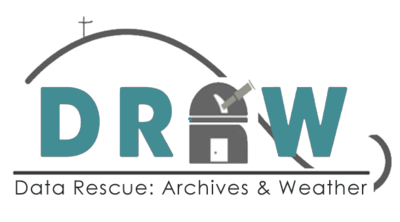

# Better Together

Better Together is a cooperative community building organization and platform. 

This project is currently in the design phase and is undergoing preliminary development. We are currently looking for people and organizations to join and help build the platform.

The Better Together platform can be deployed as a standalone application, or its independent gems can be integrated into third-party applications for a subset of its features.

## Cooperative Organization Structure
Better Together was founded to collaboratively design, build and maintain a community platform owned and operated by its members.

## Partner Organizations
Better together is proud to partner with its member organizations to sponsor the development of the platform. If you would like to support the platform by becoming a development partner, please get in touch.

## Project Architecture
### Better Together
- Main wrapper application for the platform
- Access to all the platform features from all specific domain applications
### Better Together Core
- Responsible for the core components and features shared by all domain-specific repositories
- Includes `Person`, `Group`, and `Membership`, entities.
### Domain-specific repositories
#### Communicate Together
- Depends on Better Together Core
- Communication and social interaction component
- Responsible for information publishing (Pages), discussions (Discussions, Posts, Comments)
#### Organize Together
- Depends on Better Together Core
- Planning and Scheduling component
- Responsible for collaborative organization features, including Projects, Planning, and Scheduling.
- Will aid in finding available times and places
#### Trade Together
- Depends on Better Together Core
- Asset management and trade component
- Responsible for managing inventory of assets (items), as well as trade among members
#### Decide Together
- Depends on Better Together Core
- Decision making and history component
